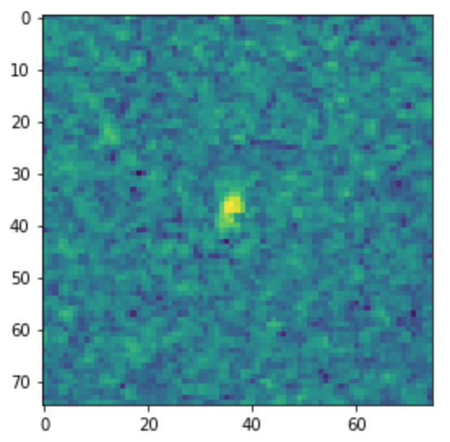
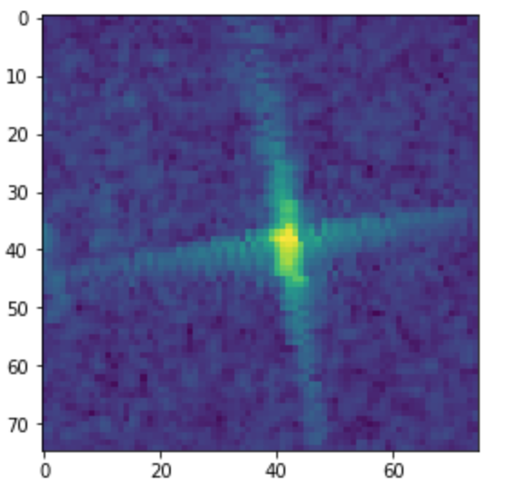
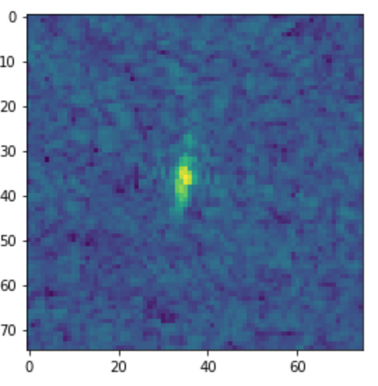
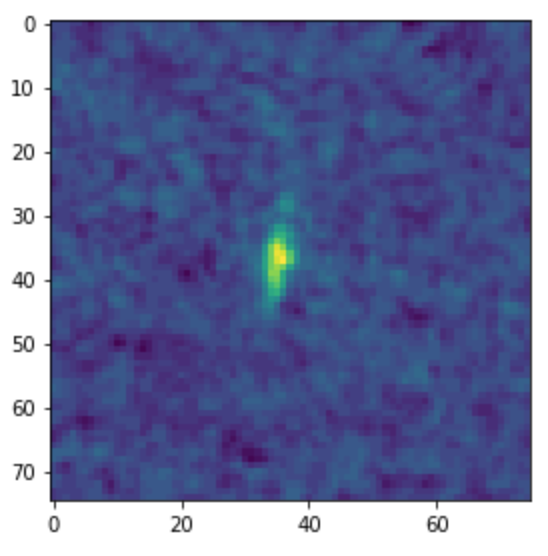
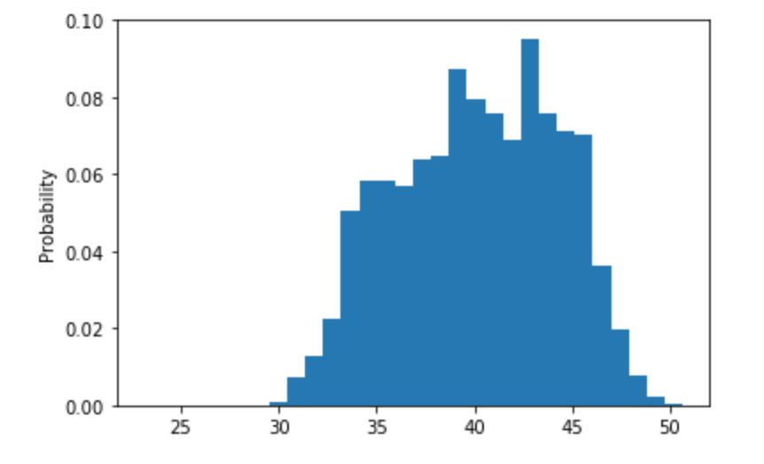
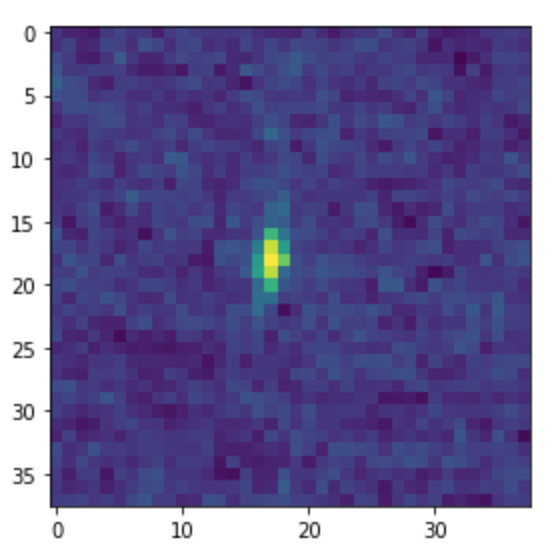
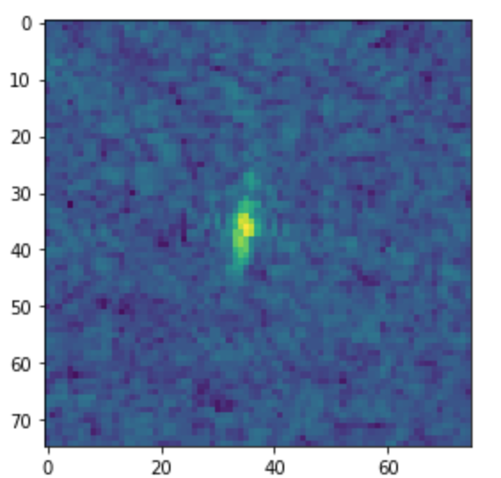
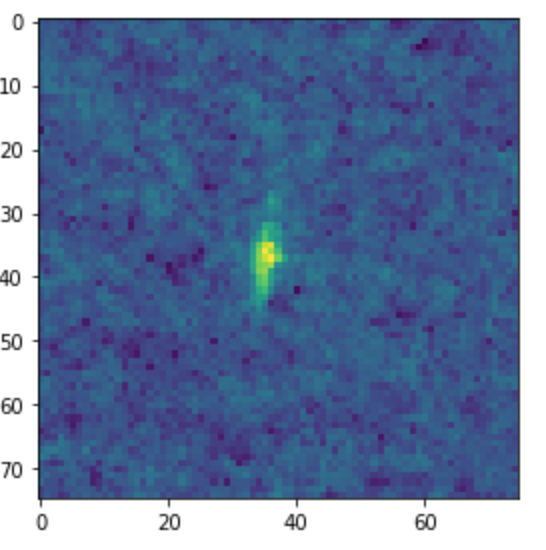

# Data Preprocessing and Augmentation

The Statoil/C-CORE Iceberg challenge provides competitors with ~1600 training sample and ~8400 testing samples of unprocessed Sentinel-1 data. 
Each sample includes the inclination angle, HH and HV polarized bands, and a value tag (iceberg or no iceberg)

Because we hope to build a convolutional neural network to classify the data, the number of training samples severly limits the depth of the models. 
Furthermore, the given data provides many corrupted data files. For many images, no incidence angle is provided. For others, backscatter renders the image almost unreadable.

My research goals aim at addressing these two problems as we construct deeper neural networks. 

## Data Preprocessing

The Sentinel-1 Satellites provides competitors with unprocessed SAR data. Due to the inherent properties of polarized data, the HH and HV bands don't provide us with enough information to cancel out most background noise. Furthermore, due to the inherent properties of SAR imaging, "speckles" of radar noise appear as random spikes.

#### Examples

Highly Speckled            | Less speckles             
:-------------------------:|:-------------------------:
|

### Filters

Filters provide us a way to remove speckle noise. Most of the filter code is adapted from the [pyradar](http://pyradar-tools.readthedocs.io/en/latest/) package. Example filters are given below

#### Filter Examples

Unfiltered          | Passed through Mean Filter          
:-------------------------:|:-------------------------:
|

#### CNN applications

Although the filters provide more visually appealing images, they have the negative effect of blurring out the edges. However, when run on the more simple CNN's, relatively simpler speckle filters provide better results. Overall the mean filter (which takes the mean of all surrounding pixels of the image), provides the best result. We used this filter for all of our filtering needs. 

### Incidence Angle Manipulation

There are 133 training points which don't have incidence angles. We can either ignore these training images and augment on the other images, or we can fill in these values. In particular, we can examine the distribution. 

#### Gaussian Angle Distribution

Note that the angles follow a Guassian Distrubtion (mean = 37.5, sigma = 3.75). We also know, from the [Sentinel 1 website](https://sentinel.esa.int/documents/247904/685163/Sentinel-1_User_Handbook), the infometric radar has an incidence angle between 29.1 and 46 degrees. 

Incidence Angle Distribution
:---------------------------:

We can fill in the incidence angle with a random value that follows this distribution. However, for augmented data sets, we won't need to do this. 

### Combining the HH and HV bands

Given the two bands, we can combine the images using a wavelet transformation and averaging. However, the image that's outputted is of size 38x38. While much better for viewing the image, our CNN should be able to better account for the differences in polarization.

Example wavelet combination
:------------:

## Data Augmentation

Data augmentation is heavily restricted by incidence angle. Since the image we are given is a crop of the larger slant-range image, it should be possible to convert this to the ground range image and reapply slanting. However, in practice, this method is incredibly costly in terms of both computing power and image resolution. Therefore, we focus on augmentation methods that don't change the incidence angle. 

### Cropping

Since the 75x75 band is just a crop of a larger swath of data, we can crop it again and train on smaller images. 

#### Methodology

We randomly take 60x60 crops of each image and adjust our neural network to take 60x60 images. After training on the augmented data set, we take random crops of the test iamges and average out the results. 

#### Results

When we augment the training set 5 times and don't augment the testing data, we have a bad leaderboard score of 0.2758. We will test this for larger amount of data augmetation and augmenting the test data.  

### Speckle Noising

We can filter our images and reapply speckle noise, simulating taking the iamge under randomly different background noise. 

#### Methodology

From [this online paper](http://ieeexplore.ieee.org/stamp/stamp.jsp?arnumber=7393462), we model speckle noise as a cross section following unit mean exponential distribution. We first apply a filter and then pointwise multiply by a new speckle noise cross section.

Original Image             | Filtered Image (median filter) | New Speckle
:-------------------------:|:------------------------------:|:-------------------------:
    |      |

#### Results

TBD